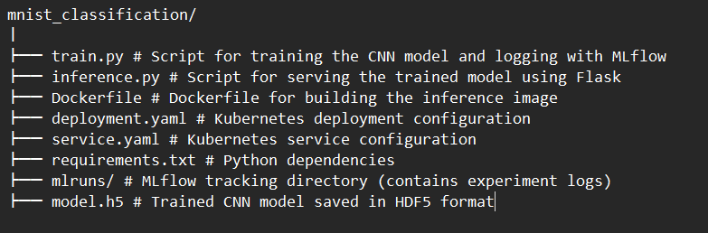

## MNIST Handwritten Digit Classification

This repository contains scripts for training a convolutional neural network (CNN) model on the MNIST dataset, serving the trained model using Flask, and deploying the inference service on Kubernetes. MLflow is used for experiment tracking during model training.

### Project Structure

